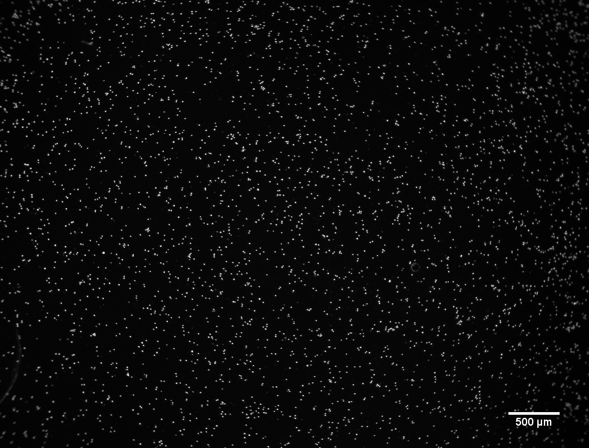
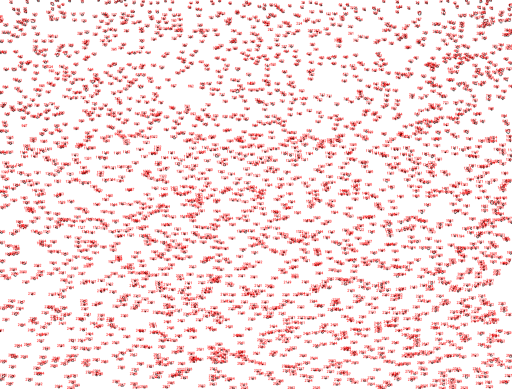

##Introduction
The purpose of this experiment was to determine the effect of Triton concentration on the fluorescence intensity of cells in PCR buffer containing 0.5X EvaGreen.  EvaGreen stains DNA and can only penetrate cells with compromised membranes, so more Triton could lead to more permeabilization and better cell staining.

The cells were imaged on a hemocytometer at 1.25X zoom (2X objective, 0.63X c-mount).  This is an example cell image:

```{r install packages, warning=FALSE, message=FALSE}
require(dplyr); require(tidyr); require(ggplot2); require(knitr)
```

```{r echo=FALSE, out.width='50%'}

```

**Figure 1. Raw image of cells stained with EvaGreen on the Olympus.**

Images were run through the imageJ macro CellIntensityAnalysis which performs flat-fielding and particle analysis to report the size and intensity of each cell above a certain threshold.  Here is an example of where the macro found particles meeting the selection criteria:

```{r echo=FALSE, out.width='50%'}

```

**Figure 2. Map of particles measured by the ImageJ macro.**

~~~~
//first remove any global scale so that all size measurements are in units of pixels
run("Set Scale...", "distance=0 known=0 pixel=1 unit=pixel global");
dir = File.directory;
name = getTitle();
namebase = replace(name, ".tif", "");
//mulitply the image by a factor of 50.  To flat field, we need to divide the image by the flat field image, so we multiply first to maintain our dynamic range.
run("Multiply...", "value=50.000");
open(dir + "20180118-flat-field-zoom-125-test4.tif");
//flat-fielding operation
imageCalculator("Divide", name,"20180118-flat-field-zoom-125-test4.tif");
selectWindow(name);
//open a copy of the image.  We will find the location of particles in this copy and measure values at the mapped locations in the original image.
run("Duplicate...", " ");
//a threshold of 805 seems appropriate for these images - above 805 is cell material, below 805 is background after flat-fielding.  4095 is the max value for these images, which were aquired with a 12-bit camera (but you might see them displayed in ImageJ as 16-bit - the highest value is still 4095).
setThreshold(805, 4095);
setOption("BlackBackground", false);
//convert the image copy to binary - particle finder's requirement.
run("Convert to Mask");
//set measurements to particle area, particle integrated density, and particle median.
run("Set Measurements...", "area integrated median redirect=" + name +" decimal=3");
//particle parameters.  currently looking for particles between 2-200 square pixels, with 0.8-1.00 circularity.  Make a new window showing particle locations.
run("Analyze Particles...", "size=2-200 circularity=0.80-1.00 show=Outlines display");
saveAs("results",  dir + namebase + ".csv");
~~~

This is the code using ImageJ's macro language.  If saved as 
```{r eval = FALSE}
//first remove any global scale so that all size measurements are in units of pixels
run("Set Scale...", "distance=0 known=0 pixel=1 unit=pixel global");
dir = File.directory;
name = getTitle();
namebase = replace(name, ".tif", "");
//mulitply the image by a factor of 50.  To flat field, we need to divide the image by the flat field image, so we multiply first to maintain our dynamic range.
run("Multiply...", "value=50.000");
open(dir + "20180118-flat-field-zoom-125-test4.tif");
//flat-fielding operation
imageCalculator("Divide", name,"20180118-flat-field-zoom-125-test4.tif");
selectWindow(name);
//open a copy of the image.  We will find the location of particles in this copy and measure values at the mapped locations in the original image.
run("Duplicate...", " ");
//a threshold of 805 seems appropriate for these images - above 805 is cell material, below 805 is background after flat-fielding.  4095 is the max value for these images, which were aquired with a 12-bit camera (but you might see them displayed in ImageJ as 16-bit - the highest value is still 4095).
setThreshold(805, 4095);
setOption("BlackBackground", false);
//convert the image copy to binary - particle finder's requirement.
run("Convert to Mask");
//set measurements to particle area, particle integrated density, and particle median.
run("Set Measurements...", "area integrated median redirect=" + name +" decimal=3");
//particle parameters.  currently looking for particles between 2-200 square pixels, with 0.8-1.00 circularity.  Make a new window showing particle locations.
run("Analyze Particles...", "size=2-200 circularity=0.80-1.00 show=Outlines display");
saveAs("results",  dir + namebase + ".csv");
```


In this experiment, Triton concentration was varied at 0.02%, 0.03%, and 0.05%, and one image was captured and analyzed at each condition.
```{r read csvs}
#find all csv's in the current directory
fileNames <- list.files(path = ".", pattern = "*.csv")
DataList <- lapply(fileNames, read.csv, header = TRUE)
ImageTitle <- substring(gsub(".csv", "", fileNames), 1, 100)
names(DataList) <- ImageTitle
#make a data frame containing one row for every particle measured
AllImages <- bind_rows(DataList, .id = "ImageTitle")
```

```{r rearrage, rename, add/delete columns}
#separate the image title column into the experimental condition "condition", and the camera exposure time "exposure".
AllImages <- separate(AllImages, ImageTitle, sep = "_FAM_", into = c("Condition", "Exposure"))
#keep only the measurement columns we're interested in, including the particle area, the integrated density "IntDen", and the median intensity.
AllImages <- select(AllImages, Condition, Exposure, Area, IntDen, Median)
AllImages <- mutate(AllImages, Mean = IntDen/Area)
#Decode the condition identity - in this experiment the conditions were three different Triton concentrations (as % w/v Triton)
AllImages <- mutate(AllImages, Triton = case_when(
  Condition == 1 ~ 0.02,
  Condition == 2 ~ 0.03,
  Condition == 3 ~ 0.05
))
```

```{r plot particle histograms}
HistPart50 <- ggplot(AllImages %>% filter(Exposure == "50ms"), aes(x = Mean)) +
  geom_histogram() +
  xlab("Particle Intensity") +
  ylab("Particle Count") +
  facet_grid(Triton ~ .) +
  theme_bw()
HistPart50
```

**Figure 3. Histogram of particle intensity at each condtion.** Cells were imaged in 0.5X EvaGreen in various concentrations of Triton (w/v%).

```{r plot violin distributions}
ViolinPart50 <- ggplot(AllImages %>% filter(Exposure == "50ms"), 
                     aes(y = Mean, x = Triton, fill = Condition)) +
  geom_violin(draw_quantiles = c(0.25, 0.5, 0.75)) +
  geom_hline(yintercept = 805, color = "orchid4") +
  ylim(0, 1700) +
  xlim(0, 0.06) +
  ylab("Particle Intensity") +
  xlab("% Titon Concentration") +
  theme_bw() +
  theme(legend.position = "none", panel.grid = element_blank())
ViolinPart50
```

**Figure 4. Violin plot of particle intensity at each condtion.** Same data from the histogram in Figure 3.  Cells were imaged in 0.5X EvaGreen in various concentrations of Triton (w/v%).  Purple line is at the threshold for cell detection, so any cells with intensity below this threshold were not measured by ImageJ.  Lines within the violin plot represent the 1st, 2nd, and 3rd quartiles.

**Table 1. Median particle intensity.** 
```{r generate summary table}
#compute the average or median particle intensity
ImgSummary <- AllImages %>% group_by(Exposure, Condition, Triton) %>% 
  summarize(Med_Intensity = median(Mean),
            N = n())
kable(ImgSummary)
```

The results in this report are for images captured at 50ms, but I also had images at 100ms.  Notice that the median intensity for condition 3 was almost the same for the 50ms and 100ms exposure times.  I wonder if this is because the intensity for some pixels was starting to max out the detector, or if the threshold used was not appropriate for both exposure times.  If we are approaching the max, maybe even 50ms is too high.

```{r plot summary statistics}
SumPlot <- ggplot(ImgSummary %>% filter(Exposure == "50ms"), aes(x = Triton, y = Med_Intensity)) +
  geom_point(size = 2, col = "orchid4") +
  ylim(0, 1500) +
  ylab("Median Particle Intensity") +
  xlab("% Titon Concentration") +
  theme_bw() +
  theme(panel.grid = element_blank())
SumPlot
```

**Figure 5. Median particle intensity.** Plot of median particle intensity vs. Triton concentration.